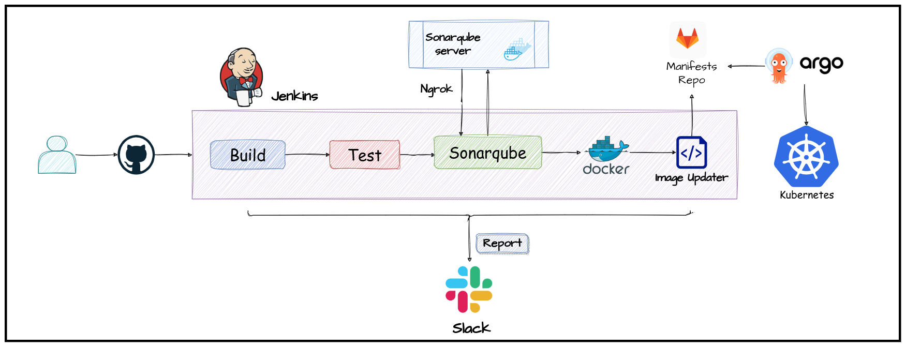

# Complete CI/CD with Jenkins and ArgoCD



## Introduction 
Welcome to my project that exemplifies the implementation of **Continuous Integration** and **Continuous Deployment** (CI/CD) practices. In this project, I have leveraged the power of **Jenkins** and **ArgoCD** to automate and streamline the entire software delivery/deployment pipeline.

With CI/CD, it eliminates the manual steps and enabled the automatic build, test, and deployment of our applications. This ensures faster release cycles, higher quality code, and improved collaboration among team members.

To ensure code quality, I have integrated SonarQube in pipeline. It performs static code analysis and provides valuable insights into potential issues, bugs, and vulnerabilities. By addressing these concerns early in the development process, we can deliver more robust and secure applications.

Furthermore, this project embraces containerization using **Kubernetes** for deployment. Kubernetes allows us to efficiently manage and scale our application containers, ensuring high availability and seamless updates.

By combining the power of Jenkins, ArgoCD, SonarQube, and Kubernetes, I have created an end-to-end CI/CD solution that significantly enhances the development process, accelerates delivery, and improves the overall quality of our software.

## Features

* A configured CI/CD pipeline for automated **building**, **testing**, and **deployment**
* Jenkins is used for automating the build and deployment process.
* **Static Code Analysis** using [SonarQube](https://www.sonarsource.com/products/sonarqube/)
* **GitOps enabled** - Utilizes **Argo CD** for **Kubernetes-based** deployment
* **Dockerized application** for easy deployment and scalability

## Prerequisites

Before getting started with this project, ensure you have the following dependencies installed:

- [Docker](https://www.docker.com/)
- [Kubernetes Cluster](https://kubernetes.io/docs/setup/) (either local or on Cloud)
- SonarQube server up and running
    - Refer the [documentation](https://docs.sonarqube.org/latest/) to configure SonarQube
- [Ngrok](https://ngrok.com/) (Running SonarQube in Docker on local machine)
- [Argo CD](https://argo-cd.readthedocs.io/en/stable/) installed

## Getting Started

### Setup the Project

To get started with this project, follow these steps:

**Clone the repository:**

  - Application source code and CI part: 
  ``` 
  git clone https://github.com/sushank3/CI_CD-portfolio.git
  ```
  
- Kubernetes manifests file.

```
    git clone https://gitlab.com/sushank3/ci_cd-portfolio.git
```
 

1. **Move to project home directory:**
    ```
    mvn clean package
    or
    mvn clean install
    ```
    Java version >= 17

2. **Run the application:**

    - **Option 1: Run locally**
        ```
        ./mvnw spring-boot:run
        ```
    - **Option 2: Run with Docker**

        1. Build the image locally:

            ```
            docker build . -t <image tag>
            ```
        2. Run the docker container:

            ```
            docker run -d -p 8085:8080 <image>
            ```

- You can now access the app at: http://localhost:8085

    

## Overview of CI/CD Workflow

### Jenkins CI - Continuous Integration

Refer the [**`Jenkinsfile`**](https://github.com/sushank3/CI_CD-portfolio/blob/main/Jenkinsfile) for the full configuration.

#### Prerequisites

- Setup the following environment variables:
    - `gitlab-token` - Gitlab access token
    - `docker_hub` - DockerHub access token
    - `sonarqube` - SonarQube token
    - `slack-jenkins` - Slack token

The CI pipeline consists of 5 stages:
stage('Build and Test') 
 stage("Static Code Analysis")
 stage("Build docker file and push")
  stage('Update Deployment File')

1. **Build** - Builds the springboot application.
2. **test** - Static code analysis using [SonarQube](https://)
3. **Build docker file and push** - Builds a new docker image and push to DockerHub
4. **Update_k8s_manifests** - Updates the latest image tag in Kubernetes manifests

> **📍NOTE:**
> 
> The CI pipeline is configured to be triggered "on push" to the project. There are two conditions defined:


##### Steps to run SonarQube Locally (Linux)

```
apt install unzip

adduser sonarqube

wget https://binaries.sonarsource.com/Distribution/sonarqube/sonarqube-9.4.0.54424.zip

unzip *

chmod -R 755 /home/sonarqube/sonarqube-9.4.0.54424

chown -R sonarqube:sonarqube /home/sonarqube/sonarqube-9.4.0.54424

cd sonarqube-9.4.0.54424/bin/linux-x86-64/

./sonar.sh start
```

You can access the SonarQube Server on **`http://<ip-address>:9000`**

#### If you are using SonarQube in Docker:
> You need to expose the Sonar Server using a tool like [Ngrok](https://ngrok.com/), for GitLab to communicate with it.
##### Steps to run SonarQube on Docker:

```
docker run -d --name sonarqube -p 9000:9000 sonarqube
```
##### Setup ngrok for port mapping of sonarqube docker container:
```
ngrok http 9000
```

Refer the [documentation](https://docs.sonarqube.org/9.6/try-out-sonarqube/) for more information.

Refer the [guide](https://ngrok.com/docs/using-ngrok-with/docker/) to know more about using **Ngrok** and **Docker** together.


### Argo CD - Continuous Deployment

Refer the [**`argCD.yaml`**](https://gitlab.com/sushank3/ci_cd-portfolio/-/blob/main/argoCD.yaml) for full application configuration for Argo CD.

A few important points for configuring Argo CD:

1. Argo CD will automatically sync the application and deploy it based on the configuration defined:

    ```
    syncPolicy:
        automated: {}

    ```
2. Monitor the deployment status and access the application once it's successfully deployed.

    

📍 To learn more about Argo CD and configure it in your cluster, refer the [documentation](https://argo-cd.readthedocs.io/en/stable/getting_started/).

## Contribute

Contributions are welcome! If you encounter any issues or have suggestions for improvements, please feel free to open an issue or submit a pull request.


## Acknowledgements

Thanks to [Abhishek Veeramalla](https://youtu.be/jNPGo6A4VHc)! for CI/CD workflow project idea.

Source link: 

IMPLEMENTING THE ULTIMATE CI/CD PIPELINE | LIVE DEMO| JENKINS END TO END PROJECT| BEST CICD PROJECT:
https://youtu.be/JGQI5pkK82w